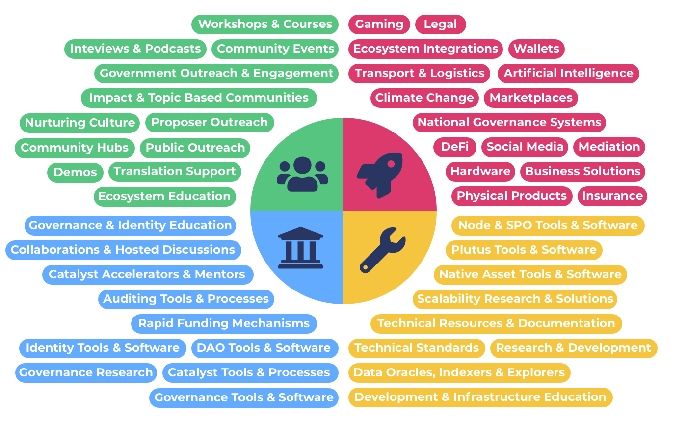

# Overview

There are a number of issues with the current [challenge setting process](https://docs.catalystcontributors.org/funding-categorisation-analysis-1/challenge-settings/challenge-setting-process) used in the Catalyst ecosystem. In this documentation you will find a break down of the current process, analysis on different ways to do categorisation, which attributes are preferable and more effective and suggestions towards an improved funding categorisation approach.

<figure><figcaption></figcaption></figure>

### Contents

* ****[**Categorisation Approaches**](broken-reference) - Analysis looking at the different approaches for funding categorisation and how they impact the funding process to determine which approaches are more desirable.
* ****[**Advantages of Suggested Idea Categories**](broken-reference) - A list of all of the advantages of using the suggested idea funding categories.
* ****[**Idea Categorisation Analysis**](broken-reference) - Analysing different factors and approaches that can be used for idea categorisations and also addressing a number of concerns and questions.
* [**Experimental Categories Analysis**](broken-reference) - Analysis for understanding why a suggested experimental category can be introduced and what problems it could help solve.
